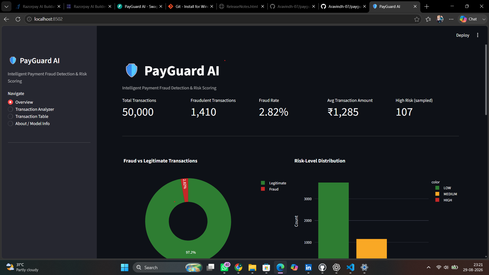

# 🛡️ PayGuard AI

### Intelligent Payment Fraud Detection & Risk Scoring System

PayGuard AI is an end-to-end machine learning prototype that analyzes payment
transactions, predicts fraud probability, assigns a 0–100 risk score, classifies
transactions into LOW / MEDIUM / HIGH risk levels, and provides explainable
reasons for suspicious activity.

Built as a portfolio project for the **Razorpay AI Builder Internship 2026**.

> ⚠️ **Disclaimer:** This is an educational prototype built using synthetic
> transaction data. It is not connected to Razorpay, real banking systems,
> payment gateways, or live financial infrastructure.

---

## 🚀 Project Demo

### Streamlit Dashboard

The interactive dashboard provides:

- 📊 Transaction analytics
- 🚨 Fraud detection
- 🎯 Risk scoring
- 🔍 Explainable predictions
- 📈 Fraud-rate visualizations
- 📋 Transaction filtering
- 🤖 Live model predictions



---

## 🎯 Problem Statement

Payment platforms process a large number of transactions every day, while
fraudulent transactions represent only a small percentage of the total volume.

This creates a challenging **imbalanced classification problem** where a model
must detect fraudulent transactions without incorrectly blocking legitimate
customers.

PayGuard AI addresses this problem using machine learning combined with a
risk-scoring and explainability layer.

---

## 💡 Solution

The system follows this pipeline:

```text
Transaction Input
       ↓
Data Validation
       ↓
Feature Preprocessing
       ↓
Machine Learning Model
       ↓
Fraud Probability
       ↓
Risk Score (0–100)
       ↓
Risk Classification
       ↓
Explainable Risk Factors
       ↓
Dashboard / API Response